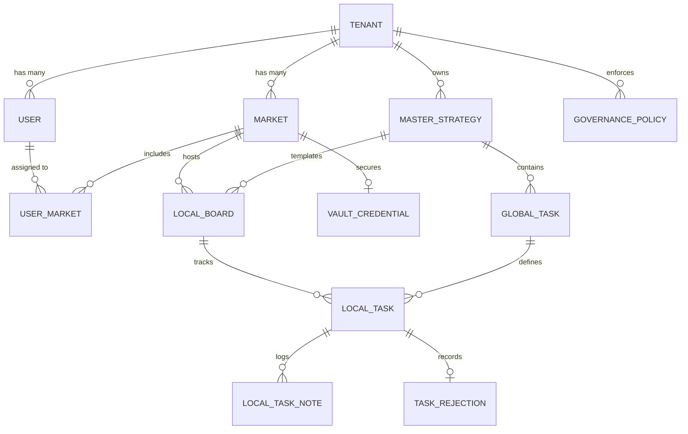

# **Stradia: Domain Model**

## **Current Implementation (Phase 1)**

The current "Walking Skeleton" uses TypeScript interfaces and Mock Data to simulate the domain model. These definitions are located in `lib/auth/types.ts`.

### **Core Types**

```typescript
export enum UserRole {
  GLOBAL_ADMIN = 'GLOBAL_ADMIN',
  SUPERVISOR = 'SUPERVISOR',
  LOCAL_USER = 'LOCAL_USER',
  READ_ONLY = 'READ_ONLY'
}

export interface MockSessionUser {
  id: string;
  tenant_id: string;
  email: string;
  role: UserRole;
}
```

---

## **Target Domain Model (Phase B)**

*The following schema represents the target architecture to be implemented using Prisma and PostgreSQL.*

I have architected the system using **Shared Schema with Row-Level Security (RLS)** to enforce multi-tenancy, and elected to use **Prisma** and **Zod** for the data contracts. I have also extrapolated dedicated tables for TaskRejection (Descartes Justificados) and LocalTaskNote (Activity Timeline) to ensure a strict, immutable audit trail.

### **1. Data Contracts (The Schema)**

```prisma
// schema.prisma

datasource db {
  provider = "postgresql"
  url      = env("DATABASE_URL")
}

generator client {
  provider = "prisma-client-js"
}

/// Core Enums [cite: 39, 60, 71, 78, 84]
enum UserRole {
  GLOBAL_ADMIN
  SUPERVISOR
  LOCAL_USER
  READ_ONLY
}

enum TaskType {
  A_MANUAL
  B_GENERATIVE
  C_EXECUTIVE
}

enum TargetPlatform {
  GTM
  GA4
  NONE
}

enum BoardStatus {
  PENDING
  ACTIVE
  COMPLETED
}

enum TaskStatus {
  TODO
  IN_PROGRESS
  BLOCKED
  DONE
}

enum PreFlightStatus {
  PENDING
  PASSED
  FAILED
}

/// The root entity representing the enterprise client[cite: 31].
model Tenant {
  id                   String   @id @default(uuid())
  name                 String
  stripe_customer_id   String?
  active_markets_limit Int      @default(1)
  user_seat_limit      Int      @default(5)
  monthly_token_quota  Int      @default(0) /// [cite: 900]
  ai_tokens_used       Int      @default(0)
  token_reset_date     DateTime
  is_active            Boolean  @default(true) /// [cite: 885]
  created_at           DateTime @default(now())

  users                User[]
  markets              Market[]
  strategies           MasterStrategy[]
  policies             GovernancePolicy[]
}

/// The individual actor interacting with the platform[cite: 38].
model User {
  id                  String   @id @default(uuid())
  tenant_id           String
  email               String   @unique
  password_hash       String?  // Nullable due to OAuth [cite: 307]
  role                UserRole
  language_preference String   @default("en")
  last_login_at       DateTime?
  created_at          DateTime @default(now())

  tenant              Tenant       @relation(fields: [tenant_id], references: [id], onDelete: Cascade)
  user_markets        UserMarket[]

  @@index([tenant_id])
}

/// The localized operational environment[cite: 44].
model Market {
  id          String    @id @default(uuid())
  tenant_id   String
  name        String
  region_code String?
  timezone    String    @default("UTC") /// [cite: 370]
  is_active   Boolean   @default(true)
  deleted_at  DateTime? /// Soft delete flag [cite: 45]

  tenant      Tenant    @relation(fields: [tenant_id], references: [id], onDelete: Cascade)
  boards      LocalBoard[]
  vault       VaultCredential[]
  users       UserMarket[]

  @@unique([tenant_id, name]) /// Unique within tenant [cite: 376]
  @@index([tenant_id])
}

/// Join table mapping users to restricted markets[cite: 42].
model UserMarket {
  user_id   String
  market_id String

  user      User   @relation(fields: [user_id], references: [id], onDelete: Cascade)
  market    Market @relation(fields: [market_id], references: [id], onDelete: Cascade)

  @@id([user_id, market_id])
}

/// The global blueprint defined by the Global Admin[cite: 52].
model MasterStrategy {
  id          String   @id @default(uuid())
  tenant_id   String
  title       String
  description String?
  version     Int      @default(1)
  is_published Boolean @default(false)
  created_by  String

  tenant      Tenant       @relation(fields: [tenant_id], references: [id], onDelete: Cascade)
  tasks       GlobalTask[]
  boards      LocalBoard[]

  @@index([tenant_id])
}

/// The individual atomic requirements within a Master Strategy[cite: 59].
model GlobalTask {
  id                      String   @id @default(uuid())
  master_strategy_id      String
  task_type               TaskType
  title                   String
  description             String?
  system_prompt           String?  /// Hidden prompt for AI [cite: 489]
  order_index             Int
  weight                  Int      @default(1) /// For heatmap scoring [cite: 512]
  target_platform         TargetPlatform
  expected_payload_schema Json?
    
  strategy                MasterStrategy @relation(fields: [master_strategy_id], references: [id], onDelete: Cascade)
  local_tasks             LocalTask[]

  @@index([master_strategy_id])
}

/// Natural language rules enforced by the AI Pre-Flight Scan[cite: 65].
model GovernancePolicy {
  id          String  @id @default(uuid())
  tenant_id   String
  policy_text String  @db.VarChar(300) /// Max 300 chars [cite: 435]
  platform    TargetPlatform @default(NONE)
  is_active   Boolean @default(true)

  tenant      Tenant  @relation(fields: [tenant_id], references: [id], onDelete: Cascade)

  @@index([tenant_id])
}

/// The localized Kanban execution environment[cite: 70].
model LocalBoard {
  id                 String   @id @default(uuid())
  market_id          String
  master_strategy_id String
  heatmap_score      Float    @default(0.0)
  status             BoardStatus @default(PENDING)

  market             Market         @relation(fields: [market_id], references: [id], onDelete: Cascade)
  strategy           MasterStrategy @relation(fields: [master_strategy_id], references: [id])
  tasks              LocalTask[]

  @@index([market_id])
}

/// The concrete, localized instance of a task on the Kanban board[cite: 77].
model LocalTask {
  id                     String   @id @default(uuid())
  local_board_id         String
  global_task_id         String?  /// Null if custom local task [cite: 78]
  status                 TaskStatus @default(TODO)
  is_custom_local_task   Boolean  @default(false)
  is_ghost_card          Boolean  @default(false) /// Optional update flag [cite: 545]
  execution_payload      Json?
  pre_flight_scan_status PreFlightStatus @default(PENDING)
  gemini_token_cost      Int      @default(0)
  error_log              String?
    
  /// Concurrency & Checkpoints
  locked_by              String?  /// Mutex lock user ID [cite: 778]
  locked_at              DateTime?
  checkpoint_state       Json?    /// Paused auth state [cite: 847]
  checkpoint_expires_at  DateTime?

  last_executed_at       DateTime?

  board                  LocalBoard  @relation(fields: [local_board_id], references: [id], onDelete: Cascade)
  global_task            GlobalTask? @relation(fields: [global_task_id], references: [id])
  notes                  LocalTaskNote[]
  rejections             TaskRejection[]

  @@index([local_board_id])
}

/// Immutable audit trail of operational chatter and collision backups.
model LocalTaskNote {
  id            String   @id @default(uuid())
  local_task_id String
  user_id       String
  content       String
  created_at    DateTime @default(now())

  task          LocalTask @relation(fields: [local_task_id], references: [id], onDelete: Cascade)

  @@index([local_task_id])
}

/// Audit log for rejected Optional Updates (Ghost Cards).
model TaskRejection {
  id            String   @id @default(uuid())
  local_task_id String
  user_id       String
  justification String
  rejected_at   DateTime @default(now())

  task          LocalTask @relation(fields: [local_task_id], references: [id], onDelete: Cascade)

  @@index([local_task_id])
}

/// The strictly isolated authentication tokens[cite: 83].
model VaultCredential {
  id                    String   @id @default(uuid())
  market_id             String
  platform              TargetPlatform
  encrypted_oauth_token String
  refresh_token         String?
  is_revoked            Boolean  @default(false) /// Hard revocation flag [cite: 831]
  updated_at            DateTime @updatedAt

  market                Market   @relation(fields: [market_id], references: [id], onDelete: Cascade)

  @@unique([market_id, platform]) /// One credential per platform per market
}
```

---

### **2. Runtime Validation (The Guardrails)**

```typescript
import { z } from 'zod';

// Validation for creating a new Governance Guardrail
export const CreateGovernancePolicySchema = z.object({
  policy_text: z.string()
    .min(10, "Rule is too short.")
    .max(300, "Rule exceeds 300 character limit.") // [cite: 435]
    .regex(/^[a-zA-Z0-9\s.,!?'-]+$/, "Invalid characters in policy."),
  platform: z.enum(["GTM", "GA4", "NONE"]),
});

// Validation for the execution payload parameters (Verified Actions) [cite: 679]
export const ExecuteTypeCTaskSchema = z.object({
  measurement_id: z.string().regex(/^G-[A-Z0-9]{10}$/, "Must be a valid GA4 Measurement ID.").optional(),
  container_id: z.string().regex(/^GTM-[A-Z0-9]+$/, "Must be a valid GTM Container ID.").optional(),
  trigger_type: z.enum(["All Pages", "CustomEvent"]).optional()
});

// Validation for Market Creation
export const CreateMarketSchema = z.object({
  name: z.string().min(2).max(50),
  timezone: z.string().refine((tz) => Intl.supportedValuesOf('timeZone').includes(tz), {
    message: "Invalid IANA timezone." // [cite: 370]
  }),
});
```

---

### **3. Domain Relationships (The Map)**



---

### **4. Security & Access Policies (The Firewall)**

To enforce the multi-tenant architecture natively in the database, Stradia must utilize PostgreSQL Row-Level Security (RLS).

```sql
-- Enable RLS on core tables
ALTER TABLE "Market" ENABLE ROW LEVEL SECURITY;
ALTER TABLE "LocalBoard" ENABLE ROW LEVEL SECURITY;
ALTER TABLE "VaultCredential" ENABLE ROW LEVEL SECURITY;

-- 1. Tenant Data Isolation Policy [cite: 29]
-- Ensures users can only query records belonging to their authenticated Tenant.
CREATE POLICY tenant_isolation_policy ON "Market"
    AS RESTRICTIVE
    FOR ALL
    USING (tenant_id = current_setting('app.current_tenant')::uuid);

-- 2. Local User Strict Sandbox [cite: 18]
-- Ensures Local Users only see data for their explicitly assigned Market IDs.
CREATE POLICY local_user_market_access ON "LocalBoard"
    FOR SELECT
    USING (
        EXISTS (
            SELECT 1 FROM "UserMarket" um
            WHERE um.market_id = "LocalBoard".market_id
            AND um.user_id = auth.uid()
        )
        OR
        (SELECT role FROM "User" WHERE id = auth.uid()) = 'GLOBAL_ADMIN' -- Global Admin override [cite: 12]
    );

-- 3. Vault Write-Only/Execution-Only Restriction [cite: 808]
-- No user can read the encrypted tokens directly; only the backend service role can SELECT for execution.
CREATE POLICY vault_write_only_policy ON "VaultCredential"
    FOR INSERT
    WITH CHECK (
        EXISTS (
            SELECT 1 FROM "UserMarket" WHERE market_id = "VaultCredential".market_id AND user_id = auth.uid()
        )
    );
```

---

### **5. Business Invariants (The "Rules of Physics")**

* **The "Last Admin" Rule:** The system strictly prevents the modification or deletion of a Global Admin if they are the only Active Global Admin remaining in the tenant.
* **Active Markets Limit:** If an organization has reached its active_markets_limit, the system must disable the creation of new markets until Stripe billing is updated.
* **The 5% Overdraft Logic:** AI task executions will be permitted if the total tokens consumed do not exceed the monthly_token_quota by more than a strict 5% buffer. Exceeding 105% results in a hard lock.
* **Execution Prerequisite:** A Local User is strictly prohibited from dragging a "Type C" task into the "Done" column unless the AI Execution Engine has returned a 200 OK success status.
* **Absolute Abandonment Timeout:** If a user establishes a Mutex Lock on a task and goes inactive, the system enforces a strict 15-minute timeout, automatically dropping the lock from the database.

---

### **6. The "Golden Record" (Mock Data)**

A fully populated LocalTask state demonstrating an active Mutex lock, an executed payload, and localized timeline notes.

```json
{
  "id": "lt-778899-abcd-1234",
  "local_board_id": "lb-112233-spain-001",
  "global_task_id": "gt-555-deploy-ga4",
  "status": "IN_PROGRESS",
  "is_custom_local_task": false,
  "is_ghost_card": false,
  "pre_flight_scan_status": "PASSED",
  "gemini_token_cost": 450,
  "locked_by": "usr-999-john-doe",
  "locked_at": "2026-02-22T10:15:00Z",
  "checkpoint_state": null,
  "execution_payload": {
    "action": "CREATE_TAG",
    "platform": "GTM",
    "schema": {
      "name": "GA4 Configuration - Base",
      "type": "ga4_setup",
      "parameter": [
        { "type": "template", "key": "measurementId", "value": "G-ABC123XYZ0" }
      ]
    }
  },
  "notes": [
    {
      "id": "note-1",
      "user_id": "usr-999-john-doe",
      "content": "Client provided the production Measurement ID over Slack.",
      "created_at": "2026-02-22T09:00:00Z"
    },
    {
      "id": "note-2",
      "user_id": "system",
      "content": "[SYSTEM AUTO-SAVE: Version Collision Detected at 2026-02-22T10:10:00Z] { \"draft_id\": \"G-XYZ987\" }",
      "created_at": "2026-02-22T10:10:00Z"
    }
  ]
}
```

---

### **7. The Seeding Specification (The Playground)**

To properly robust-test Stradia locally, the seed script must generate multi-tenant boundaries and edge cases, rather than simple isolated records.

```typescript
// seed.ts
import { PrismaClient, UserRole, TaskType, TargetPlatform, BoardStatus } from '@prisma/client';

const prisma = new PrismaClient();

async function main() {
  // 1. Create Tenant at 99% AI Quota Capacity to test 5% Overdraft logic
  const tenant = await prisma.tenant.create({
    data: {
      name: "Acme Corp Global",
      active_markets_limit: 5,
      monthly_token_quota: 100000,
      ai_tokens_used: 99500, // Edge case: Right on the threshold
      token_reset_date: new Date(new Date().setMonth(new Date().getMonth() + 1)),
    }
  });

  // 2. Create Global Admin and Local User
  const admin = await prisma.user.create({ data: { tenant_id: tenant.id, email: "admin@acme.com", role: UserRole.GLOBAL_ADMIN }});
  const localUser = await prisma.user.create({ data: { tenant_id: tenant.id, email: "spain@acme.com", role: UserRole.LOCAL_USER }});

  // 3. Create Market and assign Local User
  const market = await prisma.market.create({ data: { tenant_id: tenant.id, name: "Spain - Retail", timezone: "Europe/Madrid" }});
  await prisma.userMarket.create({ data: { user_id: localUser.id, market_id: market.id }});

  // 4. Create a Master Strategy with dependencies
  const strategy = await prisma.masterStrategy.create({
    data: {
      tenant_id: tenant.id,
      title: "Data Layer Baseline 2026",
      created_by: admin.id,
      tasks: {
        create: [
          { task_type: TaskType.A_MANUAL, title: "Review Privacy Law", order_index: 0, target_platform: TargetPlatform.NONE },
          { task_type: TaskType.C_EXECUTIVE, title: "Deploy Consent Mode", order_index: 1, target_platform: TargetPlatform.GTM, weight: 5 }
        ]
      }
    }
  });

  // 5. Clone to Local Board (Simulating a Sync Deployment)
  const board = await prisma.localBoard.create({
    data: { market_id: market.id, master_strategy_id: strategy.id, status: BoardStatus.ACTIVE }
  });

  console.log("✅ Seed complete: Built Tenant, Users, Markets, and relational Strategic Tasks.");
}

main().catch(console.error).finally(() => prisma.$disconnect());
```

---

Since Stradia involves collaborative localized environments with concurrency controls (Mutex Locks), the WebSocket layer must be just as strictly typed and secure as the database.

### **1. WebSocket Event Enums (The Dictionary)**

We must define exact event names to prevent silent failures caused by typos between the client and server.

```typescript
// ws-events.ts

export enum ClientToServerEvent {
  JOIN_BOARD = "client:join_board",
  LEAVE_BOARD = "client:leave_board",
  REQUEST_TASK_LOCK = "client:request_task_lock",
  RELEASE_TASK_LOCK = "client:release_task_lock",
  MOVE_TASK = "client:move_task",
}

export enum ServerToClientEvent {
  ERROR = "server:error",
  BOARD_STATE_SYNC = "server:board_state_sync", // Full refresh
  TASK_LOCKED = "server:task_locked", // Broadcast to others that a task is busy
  TASK_UNLOCKED = "server:task_unlocked",
  TASK_MOVED = "server:task_moved",
  NOTE_ADDED = "server:note_added",
  EXECUTION_COMPLETED = "server:execution_completed", // Triggered after AI webhook returns
}
```

### **2. Payload Schemas (The WS Guardrails)**

Just like REST API endpoints, every incoming and outgoing WebSocket message must be validated at runtime. We will use Zod for this.

```typescript
import { z } from 'zod';
import { TaskStatus } from '@prisma/client'; // Re-using Prisma Enums

// ---------------------------------------------------------
// Client -> Server Payloads
// ---------------------------------------------------------

export const JoinBoardPayloadSchema = z.object({
  local_board_id: z.string().uuid(),
});

export const MoveTaskPayloadSchema = z.object({
  local_board_id: z.string().uuid(),
  local_task_id: z.string().uuid(),
  new_status: z.nativeEnum(TaskStatus),
  expected_previous_status: z.nativeEnum(TaskStatus), // Optimistic concurrency check
});

// ---------------------------------------------------------
// Server -> Client Payloads (Broadcasts)
// ---------------------------------------------------------

export const TaskMovedBroadcastSchema = z.object({
  local_board_id: z.string().uuid(),
  local_task_id: z.string().uuid(),
  new_status: z.nativeEnum(TaskStatus),
  moved_by_user_id: z.string().uuid(),
  timestamp: z.string().datetime(),
});

export const TaskLockedBroadcastSchema = z.object({
  local_board_id: z.string().uuid(),
  local_task_id: z.string().uuid(),
  locked_by_user_id: z.string().uuid(),
  locked_at: z.string().datetime(),
  expires_at: z.string().datetime(), // Enforces the 15-minute absolute abandonment rule
});
```

### **3. Connection & Channel Security (The Airgap)**

Database Row-Level Security (RLS) does not automatically protect WebSocket pub/sub channels (like Redis PubSub or Socket.io rooms). We must explicitly enforce the architectural constraints at the connection and subscription levels.

**Business Invariants for Real-Time:**

1. **Handshake Authentication:** The WebSocket connection must be established by passing the JWT token (or session cookie) in the initial connection headers. If verification fails, the socket drops immediately.
2. **Room Authorization (The Sandbox):** When a client emits client:join_board, the server MUST query the database to verify that the user_id has access to the market_id associated with that local_board_id.
3. **Execution Verification Gate:** If a client emits client:move_task attempting to transition a Type C (Executive) task to DONE, the WebSocket server must intercept this, query the database, and verify pre_flight_scan_status === 'PASSED' and that a successful external API execution log exists. If not, it emits a server:error and forces the client to revert the card visually.

---
